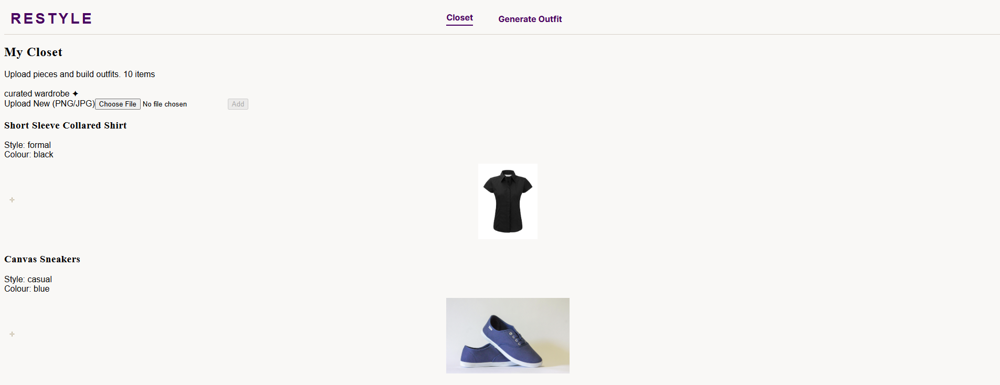
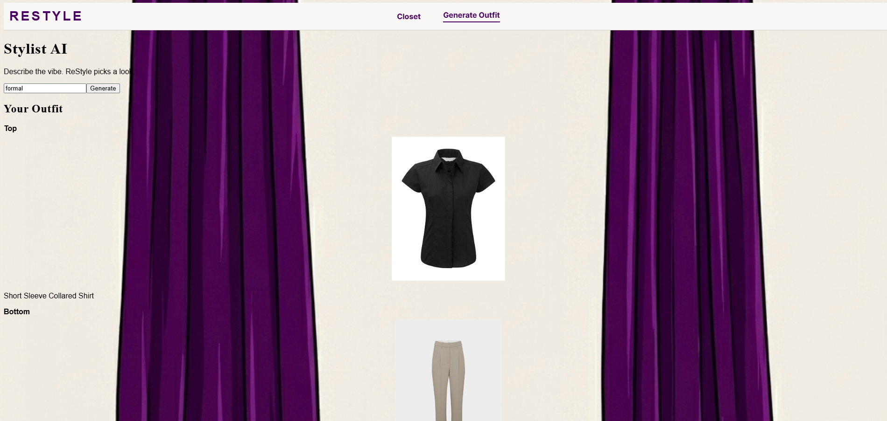
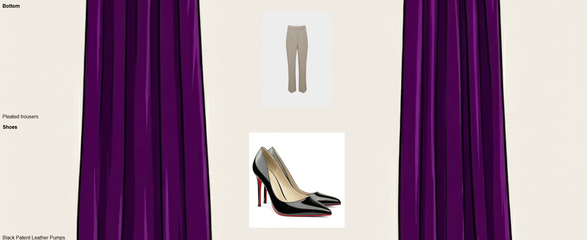

# ReStyle: an AI Outfit Generator

How many times have you walked into your closet and felt that you had **"nothing"** to wear? ReStyle is a full-stack web application that helps users generate outfit recommendations based on their personal wardrobe and a desired style or "vibe". ReStyle combines a clean UI with AI-driven logic to curate complete outfits from uploaded clothing items. 

ReStyle is designed not only as a styling tool, but as a sustainable fashion assistant that promotes conscious consumption and reduces clothing waste. Instead of encouraging users to constantly buy new clothing, ReStyle helps users rediscover and rewear items they already own by presenting them in new, curated outfit combinations.

## ✨ Features
- **Digital Closet**
    - Upload and store clothing items with images and descriptions
    - View all wardrobe items in a clean, card-based layout
- **AI Outfit Generation**
    - Generate outfits based on style prompts (e.g., date night, streetwear, cozy café)
    - Automatically selects tops, bottoms, and shoes from the user’s closet
- **Interactive UI**
    - Hover over outfit images to reveal item descriptions
    - Responsive design for desktop and mobile devices

## 🛠 Tech Stack
**Frontend**
- React
- TypeScript
- Vite
- Tailwind CSS
- React Router
- Axios for API requests

**Backend**
- Node.js
- Express
- MongoDB (wardrobe storage)
- Gemini APIs

**Development Tools**
- Postman for API testing & debugging

## 🧠 How it works
1. Users upload clothing items to their digital closet
2. Items are stored in a MongoDB database
3. The user enters a style prompt
4. The backend processes the wardrobe and returns an outfit
5. The frontend displays the outfit with interactive hover descriptions

## 📚 Future Improvements
- User authentication and profiles
- Outfit saving and favourites
- Colour-based outfit matching
- AI Suggestions that help you shop for the future

Closet Page:

Generate Outfit Page:

